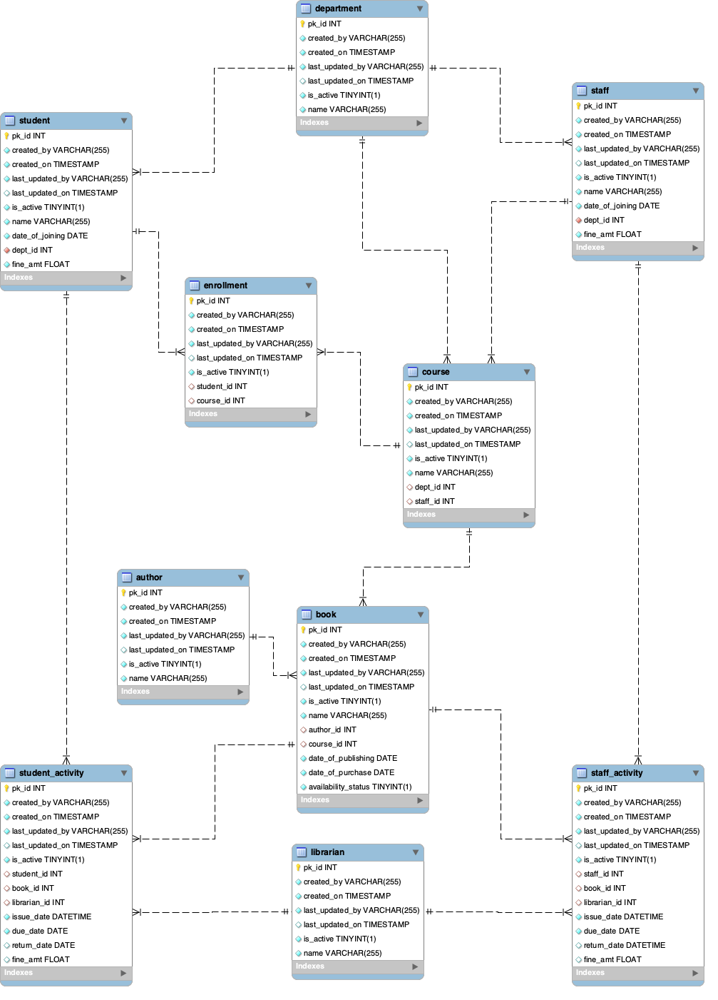

.. Assignment - V documentation master file, created by
.. sphinx-quickstart on Tue Sep  7 12:34:41 2021.
.. You can adapt this file completely to your liking, but it should at least
.. contain the root `toctree` directive.

Library Management System using ORM
==========================================

Alpha University is a reputed institution with more than 5000 students and 300 teaching staff.
Recent survey results indicate that their library facilities are not upto standards. To counter
the issue, the management decides to have an online portal where users (students and staff)
can borrow books from the library and pay fine online, in case of late return. Users can also
search for books to get to know the current status of the book (borrowed or available).

.. toctree::
   :maxdepth: 2
   :caption: Contents:

   solution.create_classes
   solution.populate_tables
   solution.query_tables

Indices and tables
==================

* :ref:`genindex`
* :ref:`modindex`
* :ref:`search`
